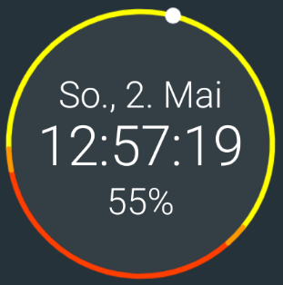

# sunrise-sunset-widgets

A small Android widget app that shows a clock together with a visual representation when the sun will rise and set based on the location.

This is currently work in progress.

## Supported features:
* Add widget to home screen
* The widget shows:
  * The current time (as 12 hour or 24 hour format, including seconds or not)
  * A circle with a marker for the current time and background for sunrise and sunset
  * The date
  * The current battery status
* The widget is updated automatically (when the device is awake)
* Colors are configurable per widget
* Clock is configurable per widget
* Location is configurable per widget

## Features needed for version 1.0:
* Show icons before date and battery
* Open time, calendar, battery apps/settings when clicking on the relevant views
* Clean up main activity, to add instructions to first add a widget
* Allow to configure widgets when adding them
* Update widget when day changes
* Update widget when orientation changes (or support landscape another way)
* Support locations without sunrise, sunset (polar circles)

## Roadmap:
* Update location automatically
* Show current style in configuration activity directly
* Show weather
